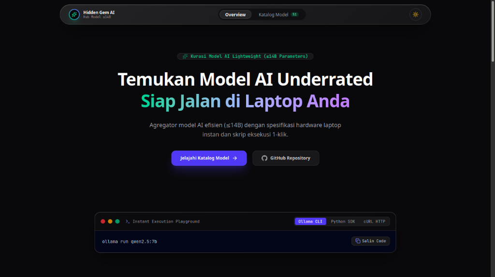
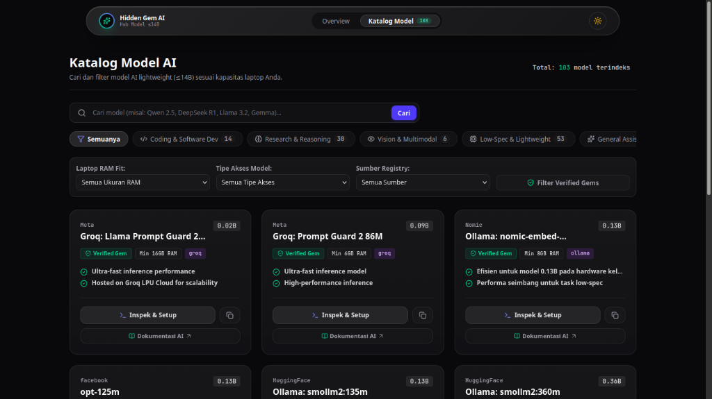

# Hidden Gem AI Discovery Hub

Agregator model AI terotomatisasi untuk mengindeks 103+ model AI berukuran efisien (<=14B parameters) yang siap dijalankan pada spesifikasi laptop terjangkau (8GB - 16GB RAM).

Repository URL: https://github.com/putrarawr/HiddenGemAIModel

---

## Preview Antarmuka Aplikasi

### Overview Landing Page


### Katalog Model AI


---

## Fitur Utama

- 103+ Curated AI Models Dataset: Mengindeks 103 model AI efisien (<=14B) dari berbagai sumber registry ternama.
- Automated Multi-Source Mining: Indeks terotomatisasi dari OpenRouter Free Models, Hugging Face Hub Open-Weights, Ollama Library, dan Groq Cloud LPU API.
- Duplicate Validation & Skip System: Skrip sinkronisasi mendeteksi model yang sudah terindeks berdasarkan slug dan metadata untuk mencegah duplikasi data.
- Hardware RAM Fit Scoring: Mengkategorikan kebutuhan RAM laptop (Tier 8GB, 12GB, 16GB) berdasarkan estimasi kuantisasi 4-bit (Q4_K_M).
- One-Click Execution Config: Menyediakan perintah instan untuk Ollama CLI, Python SDK (Hugging Face Transformers), dan cURL HTTP API.
- Direct Official Documentation Link: Setiap model memiliki tautan langsung ke halaman dokumentasi resmi AI (OpenRouter, Hugging Face Hub, Ollama Library, Groq Cloud).
- Obsidian Liquid Glass UI: Antarmuka modern dengan komponen kaca cair, animasi Framer Motion, filter kategori interaktif, pagination (9 model per halaman), skeleton loader, dan switch mode gelap/terang.

---

## Teknologi Stack

- Backend Framework: Laravel 12 (PHP 8.5)
- Frontend Library: React 19, Framer Motion, Lucide React
- Styling Engine: Tailwind CSS v4 (Obsidian & Soft Slate Theme)
- Build System: Vite v8
- Database: PostgreSQL (ai-model-db)
- LLM Extractor Agent: Gemini / Groq API

---

## Persyaratan Sistem

- PHP 8.2 atau lebih baru
- Composer 2.x
- Node.js 18.x atau 20.x dan NPM
- PostgreSQL Server 14+
- Ollama CLI (opsional, untuk menjalankan model lokal)

---

## Cara Instalasi dan Setup Project

### 1. Clone Repository

```bash
git clone https://github.com/putrarawr/HiddenGemAIModel.git
cd HiddenGemAIModel
```

### 2. Instalasi Dependensi Backend (PHP)

```bash
composer install
```

### 3. Konfigurasi Environment File

Salin file `.env.example` menjadi `.env`:

```bash
cp .env.example .env
```

Sesuaikan konfigurasi koneksi database PostgreSQL pada file `.env`:

```env
DB_CONNECTION=pgsql
DB_HOST=127.0.0.1
DB_PORT=5432
DB_DATABASE=ai-model-db
DB_USERNAME=postgres
DB_PASSWORD=
```

Generate application key:

```bash
php artisan key:generate
```

### 4. Migrasi Database dan Seed Dataset Awal

Jalankan perintah migrasi tabel database dan impor dataset 103 model AI terkurasi:

```bash
php artisan migrate --force
php artisan app:import-models
```

### 5. Instalasi & Build Dependensi Frontend (Assets)

```bash
npm install
npm run build
```

### 6. Jalankan Server Lokal

```bash
php artisan serve
```

Aplikasi web dapat diakses di browser melalui alamat: `http://127.0.0.1:8000/`

---

## Command CLI Utama

### 1. Scraping & Sync Model Baru (Auto Skip Duplikat)

Untuk menjalankan scraper terotomatisasi mengindeks model AI baru dan mengekstrak metrik hardware:

```bash
php artisan app:sync-models
```

Opsi Perintah:
- Sync khusus sumber tertentu: `php artisan app:sync-models --source=openrouter` (opsi: `all`, `openrouter`, `huggingface`, `ollama`, `groq`).
- Paksa timpa model lama: `php artisan app:sync-models --force`.

### 2. Ekspor Dataset Model ke File JSON

Untuk mengekspor seluruh data 103 model AI dan kategori ke dataset portabel JSON:

```bash
php artisan app:export-models
```

File hasil ekspor tersimpan di `storage/app/ai_models_export.json` dan `database/seeders/data/ai_models_export.json`.

### 3. Impor Dataset dari JSON

```bash
php artisan app:import-models
```

---

## Lisensi

Project ini dirilis di bawah lisensi MIT License.
